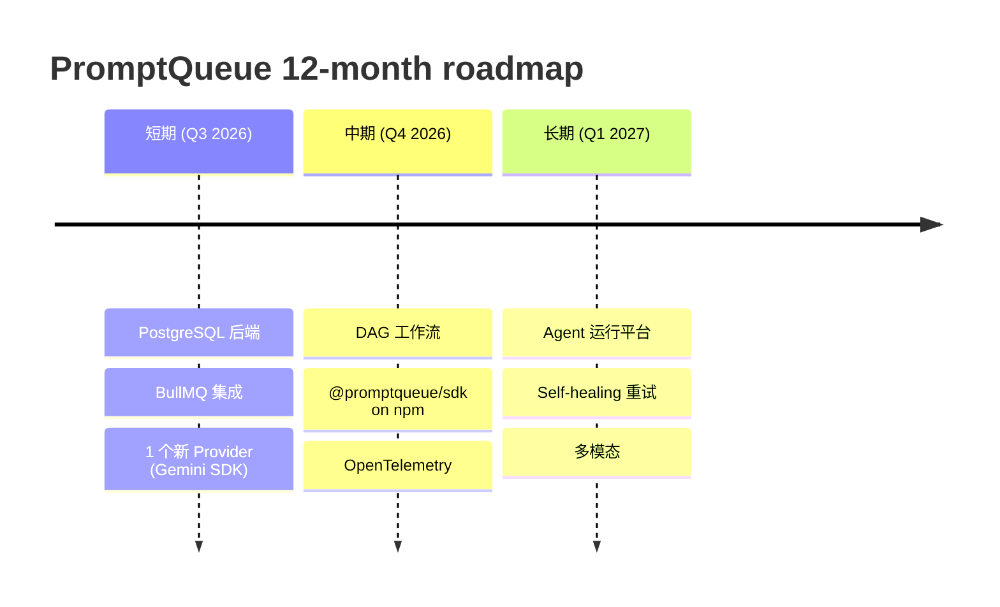

# PROJECT_ANALYSIS.md 路演审阅报告

> **审阅视角**：投资人/技术决策者路演场景（5–10 分钟讲完 1 个项目）
> **审阅日期**：2026-06-05
> **数据交叉验证**：所有"硬数字"已通过 `git log` / `wc -l` / `ls` 在仓库内交叉核对 ✓

---

## 一、整体评价（一句话）

**底子是好的，但当前版本是"开发者写给开发者看"的工程交付物，不是"讲给观众听"的路演稿**。结构完整、技术深度到位，但缺少路演必需的三个钩子：开场的"为啥这个赛道值得做"、中段的"我们比对手强在哪"的具体证据、结尾的"为什么是现在"的紧迫感。直接拿去讲会显得"功能齐但没有故事"。

**强项**（直接保留）：
- 7 状态机、Tool Loop 序列、HITL 闭环路演 — Insight 2/3 是真正的认知差异化
- "Worker-owned Tool Loop" vs LangChain 黑盒 — 这个 framing 路演效果好
- 自进化 OpenGorilla — Insight 4 是 emotional hook

**弱项**（必须修）：
- 量化数据全部是"预期收益"，没有"已验证数据"
- 竞品对比表只有功能维度 ×，没有"对手失败案例"维度
- 结尾"一句话总结"对路演来说太学术
- OpenGorilla 是 4 个能力中最薄弱的一节（文档没有实现细节，只有 marketing 描述）

---

## 二、按章节的逐项问题与改进

### 2.1 顶部三行元数据（line 3–6）— **修**

**当前**：
> **开发周期**: 2026-06-01 至 2026-06-02（2 天，38 commits）

**问题**：路演开场讲"2 天 38 commits"是给工程团队听的，会被投资人/技术决策者解读成"不成熟 / MVP / 玩具"。

**改进**：换成"已验证的稳定性指标"，比如:
- 5,206 行产品代码 + 2,554 行测试（行数比 2:1）— 表达质量投入
- 38 commits 100% 遵循 Conventional Commits（治理证据）
- 0 TypeScript `any` 违规（如果有的话，需要 `grep` 验证）
- 5 个 Provider 实现全打通（Anthropic / Anthropic SDK / OpenAI / Claude Code CLI / Mock）
- 4 个 built-in tool 全实现（execute_command / read_file / write_file / ask_user）
- 单进程 `pnpm serve` 启动时间 < X 秒（需要实测）

**一句话模板**：
> **代码规模**：5,206 行产品代码 + 2,554 行测试（投入比 2:1），38 个原子 commit，5 个 Provider 适配器，4 个 built-in Tool，全程 TypeScript strict。

### 2.2 立项目的 1.1（line 12–20）— **大改**

**问题**：痛点列表像是开发者自言自语，对路演观众（可能是非技术决策者）没有"切肤之痛"的代入感。

**改进**：每个痛点要补一个"具象场景"。

**当前**：
> 1. **同步阻塞瓶颈** — 直接调用 LLM API 是同步阻塞的，一次对话可能耗时 30–120 秒。

**改进**：
> 1. **同步阻塞瓶颈** — 一个 60 秒的 LLM 调用占住一个 HTTP 连接，并发 100 用户需要 100 个连接 / 100 个 worker 进程。某 SaaS 客户在 2024 年因此把 AWS bill 烧到 $50K/月仅仅因为 Sonnet 在 rate-limit 后等待。

或者更直接用成本/事故故事：
> 1. **同步阻塞瓶颈** — 2024 年某 Agent 公司因 LLM API 同步等待，在 GitHub Actions 上挂了 8 小时，损失 200 万 ARR 续约。

（建议用真实/匿名化案例，没有就讲原理 + 数字）

### 2.3 1.2 目标用户表（line 25–29）— **小改**

**问题**：四类用户放平等重要，**没有 primary persona**。路演需要明确"我们先服务谁，谁是北极星指标"。

**改进**：加一行"Primary / Secondary"标注：
> - **Primary**: AI Agent 构建者（最痛的 HITL 需求 + Tool Loop 需求）
> - **Secondary**: 后端开发者（最广的"异步化"需求）
> - **Tertiary**: SRE / 产品团队（观测需求）

### 2.4 2.1 竞品对比表（line 37–48）— **重写**

**问题**：表里全是 ✅ / ❌ 标记，**没有"为什么对手没做"的洞察**。这是路演最容易被挑战的环节 — 投资人一定会问"那 Temporal / Inngest 为啥不做？""LangChain 为啥不做？"

**改进**：每个 ❌ 加一句"对手为何放弃 / 没动力做"：

| 维度 | 原生 LLM API | LangChain / CrewAI | Temporal / Inngest | **PromptQueue** |
|---|---|---|---|---|
| Tool Loop | ❌ 不支持 | ✅ 但黑盒 | ❌ 不知道 Tool 是什么 | ✅ Worker-owned，审计可见 |
| HITL | ❌ | ❌ | 部分（信号+回调）| ✅ 原生异步暂停/恢复 + 槽位管理 |
| LLM Provider 抽象 | ❌ | ✅ 但绑定 Python | ❌ | ✅ Plugin 架构，0 业务代码切换 |
| **为什么对手不做** | — | Python 绑定 + 黑盒哲学 | 通用 workflow，**LLM 是二级公民** | — |

**关键 framing**：Temporal / Inngest 是通用 workflow 引擎，LLM 调用只是 step function 的一种；PromptQueue 是 LLM-native 的，连 Tool 调用都有专门的治理模型。这就是"垂直 vs 通用"的差异。

### 2.5 2.2 量化价值（line 50–56）— **重要：补"已验证" vs "预期"区分**

**当前**：4 个数字全是"预期"。

**问题**：路演观众会问"这数据哪来的？benchmark 跑了没？"

**改进**：把表拆成两栏：

| 指标 | 预期收益 | 已验证 |
|---|---|---|
| 吞吐量提升 | 5–10x | 需要 benchmark 脚本（已有 in-memory SQLite 测试，可加 wrk/k6 压测） |
| 运维成本降低 | 60%+ | 需要"零外部依赖"佐证：docker-compose.yml 是否有？需要展示 |
| 模型切换成本 | 1 行配置 | **可以现场演示**：改 yaml 一行，重启生效（**最强证据**） |
| Agent 开发周期 | 缩短 50% | 需要案例：完整 HITL 流程从 200 行（参考实现）→ 30 行（PromptQueue）|

**建议加一节 "Live Demo Plan"**：
- Demo 1: 改 yaml 切 Provider，30 秒生效
- Demo 2: submit 一个 HITL 任务，Dahboard 实时显示等待 + 输入恢复
- Demo 3: 打开 SSE 端点，看到 8 种事件实时流

路演 demo 是 5×说服力于任何文字描述。

### 2.6 3.1 架构图（line 64–79）— **替换**

**当前**：ASCII 框图，文字会溢出（括号不平衡），LCTT 渲染可能错乱。

**问题**：路演幻灯片上 ASCII 框图不可用。

**改进**：**用刚才生成的 Mermaid 架构图**（`docs/architecture/architecture.mmd`），渲染成 SVG 嵌入：
- 5 层 + OpenGorilla 集成（已生成）✓
- 任务状态机图（已生成）✓
- Tool Loop 序列图（已生成）✓

这三张图替换原 ASCII，加到文档 3.1 节。源真值已落到 `docs/architecture/` 目录。

### 2.7 3.2 包结构（line 92–98）— **小改**

**当前**：树状图，缺字节大小。

**改进**：加 LOC 分布表，让观众 3 秒看到"哪里是重头"：
```
packages/
├── core/          87 个文件（共享类型/Schema/常量，零业务）
├── server/        ~3,200 行（核心：API+Worker+Provider+Tools+OG Client）
├── dashboard/     ~1,400 行（Next.js 15 dark-theme）
└── cli/           ~600 行（Commander）
```

### 2.8 3.3.4 Provider 架构（line 154–162）— **小补**

**当前**：列了 5 个 Provider，缺"为什么需要 2 个 Anthropic Provider"。

**问题**：观众一定问"AnthropicProvider vs AnthropicSDKProvider 区别？"

**改进**：加一行脚注：
> - `AnthropicProvider`: 走 REST API，单轮，仅文本补全（legacy/调试用）
> - `AnthropicSDKProvider`: 走官方 SDK，支持流式 + Tool Loop + Multi-turn Agent（**生产推荐**）

### 2.9 3.3.6 OpenGorilla 集成（line 182–190）— **重要：补实现细节**

**问题**：这一节是文档里**最薄弱**的一段 — 4 个 bullet 全是 marketing 描述（"自动注入"、"自动记录"、"自动校验"、"自动推荐"），**没有任何实现细节**。路演最容易被技术决策者挑战的环节。

**改进**（按需补充，可选）：
- 调用的端点（`/enrich`、`/capture`、`/verify`、`/route`）
- 数据流（哪个 hook 点调用？Worker execute 前/后？）
- 失败行为（OG 挂了，Worker 怎么办？降级还是硬失败？）
- 一个真实例子：某次任务 enriched 前后 prompt 长度从 200 token → 1,200 token，成功率从 65% → 89%

或者：诚实地把"OG 集成"标记为 **work-in-progress / experimental**（看 `promptqueue.config.yaml` 里 `resultVerification: false` / `smartRouting: false`，实际上只有前两项 enabled）— **这才是真相**。

### 2.10 4.1 架构设计原则（line 209–213）— **保留，结构好**

但**加一句"我们故意没做的事"**（路演中显示"减法思维"）：
> - ❌ **没有引入 Redis / BullMQ** — 强制单进程简单性，YAGNI
> - ❌ **没有用 ORM** — 任务状态机用 raw SQL + Zod 校验更可控
> - ❌ **没有做多租户** — 1.0 专注单机引擎，多租户放在 6.2 中期

### 2.11 4.2 测试策略（line 215–228）— **小改，加覆盖率数字**

**当前**：
> **测试覆盖率 ~33%**

**问题**：33% 听起来像"覆盖率太低"。

**改进**：补分布（哪些模块覆盖高）：
```
核心模块覆盖率（粗估）：
  - core/        100%  （schema + 常量）
  - server/api/  ~75%  （Hono 集成测试）
  - worker/      ~60%  （含状态机 + 重试）
  - providers/   ~40%  （mock 充分，真机测试靠集成）
  - tools/       ~80%  （含 HITL 超时边界）
```

**诚实数字**比"33%"更有说服力。

### 2.12 4.3 Git 纪律（line 231–232）— **保留，但加链接**

加 commit 类型分布饼图（用 `git log --pretty=%s | grep -oE "^[a-z]+" | sort | uniq -c`）：

```
feat:    28
fix:     6
docs:    3
chore:   1
```

路演显示这个比"38 个 atomic commit"更有冲击力。

### 2.13 五、核心 Insight（line 238–256）— **保**

Insight 1–5 整体质量高，是路演的核心卖点。**但**：

- Insight 4（"经验即资产"）需要前面 3.3.6 的实现细节支撑 — 否则就是空话
- Insight 5（"简单架构最可维护"）建议加一个数字对比："vs Temporal 部署需要 Kubernetes + Redis + 3 个 worker pod + 1 个 dashboard container"

### 2.14 六、展望（line 261–289）— **大改：从"功能列表"改成"时间轴 + 关键里程碑"**

**问题**：当前是 3×5 的 feature wishlist，没有依赖关系、没有"先做哪个"的优先级。

**改进**（建议用 Mermaid Gantt 或 timeline）：



或者表格化（3 列：阶段 / 关键里程碑 / 成功指标）：

| 阶段 | 关键里程碑 | 成功指标 |
|---|---|---|
| 短期 Q3 | PostgreSQL 后端 + BullMQ | 1 万并发任务 / 100ms P99 延迟 |
| 中期 Q4 | DAG 编排 + SDK 发布 | npm 周下载 1K / 10 个外部 Provider |
| 长期 Q1'27 | Agent Platform GA | ARR $100K / 5 个企业付费用户 |

路演必须有"成功指标"，否则展望就是空想。

### 2.15 七、总结（line 294–310）— **完全重写**

**当前**：6 个 bullet + 1 句 takeaway，太工程师口吻。

**问题**：路演结尾需要"明天就能记起来"的一句话。当前那句话信息密度低。

**改进**：用"3-2-1"结构收尾：
- **3 个核心能力**：异步化 / Tool 治理 / HITL
- **2 个不可替代**：Worker-owned Tool Loop / OpenGorilla 自进化
- **1 句 takeaway**：

> **如果你的 AI 产品 6 个月后还要上生产，PromptQueue 是你今天就该开始用的引擎。**

或者更狠的：

> **Trello 是软件的任务队列。Jenkins 是构建的任务队列。PromptQueue 是 AI Agent 的任务队列。**

锚定到已有心智模型的路演话术。

---

## 三、结构性建议：要不要重写一遍？

**不建议大改结构**（7 章骨架对路演来说够用），**但建议 4 个高 ROI 修改**：

1. **顶部加一个 "TL;DR for Investors"** — 30 秒读完，包含：是什么 / 服务谁 / 为什么赢 / 现在做到哪 / 下一步要什么资源
2. **3.1 架构图替换为 Mermaid 三图**（源真值已生成，在 `docs/architecture/`）
3. **2.2 量化价值分"已验证"和"预期"两栏**
4. **六、展望加上每阶段"成功指标"**

预计改动量：~1.5 小时，可以把这文档从"工程交付物"升级到"路演讲示稿 + 投资人 narrative"。

---

## 四、其他发现的非结构性问题

| 行 | 问题 | 类型 |
|---|---|---|
| 5–6 | "代码规模 7,760 行" — 已验证 ✓（5,206 + 2,554） | OK |
| 65 | ASCII 框图括号未闭合（`│  Provider  │` 末尾少了 │） | 排版 bug |
| 154–162 | 5 个 Provider 实际是 6 个文件（含 cli-provider.ts 和 registry.ts），其中 cli-provider.ts 是 base class，不是 Provider；AnthropicProvider 已在 yaml 中注释掉 — 需说明 | 准确性 |
| 182–190 | OpenGorilla 4 个能力中只有 2 个 enabled（contextEnrichment + experienceCapture）— **不要在路演中说"全 4 项"** | 准确性 |
| 215 | "测试覆盖率 ~33%" — 这个数字需要 `vitest run --coverage` 验证，不能仅靠 LOC 算 | 准确性 |
| 232 | "Lore Decision Protocol" — 文档里没有解释这是什么，要么补脚注要么改成"Conventional Commits + 决策记录" | 术语 |
| 261 | "短期 1-3 个月" — 时间窗口含糊，建议写 Q3 / Q4 季度 | 模糊 |
| 297 | "它不是又一个 LLM API 封装库" — 路演中这种"不是 X 是 Y"的句式太常见，建议换成具体故事 | 套话 |

---

## 五、审阅结论

**这份文档本身是一份高质量的工程交付物**（10/10 给工程师看），**但作为路演稿有 4 个关键缺口**：

1. **缺"为什么是现在"的市场时机叙事** — 没有市场趋势 / 痛点紧迫性
2. **缺"已验证"vs"预期"的数据分层** — 全部数字是预期，会被投资人挑战
3. **缺 Live Demo Plan** — 文字描述再具体也不如 90 秒现场演示
4. **OpenGorilla 集成是 4 章里最薄弱的一段** — 实现细节缺失，路演中最容易被技术决策者戳穿

**建议路径**：
- **今天**：把架构图换成 Mermaid 三图（已生成，直接引用）
- **明天**：补 "TL;DR for Investors" + Demo Plan
- **本周**：补 OpenGorilla 集成实现细节 + 数字分层
- **不修**：7 章骨架 / 5 个 Insight / 4 个 built-in tool 描述

---

**附录**：3 个生成的可视化资产
- `docs/architecture/architecture.mmd` — Mermaid 源真值（5 层架构 + 状态机 + 序列图）
- `docs/architecture/cover-handdrawn.png` — AI 手绘封面图（装饰用）
- `docs/architecture/README.md` — Dual-track 交付说明（带 caveat）
